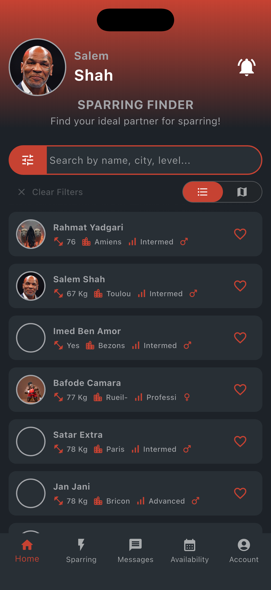
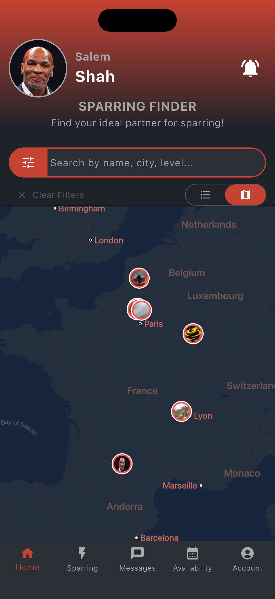
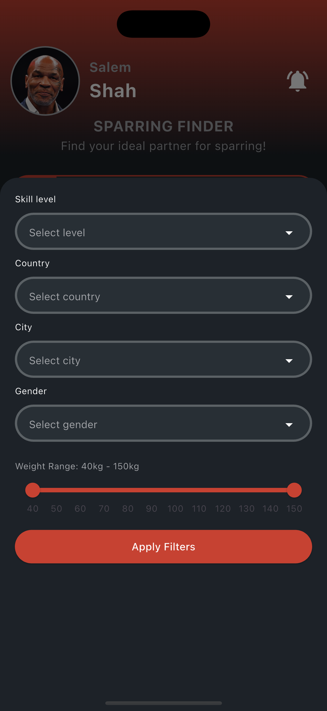
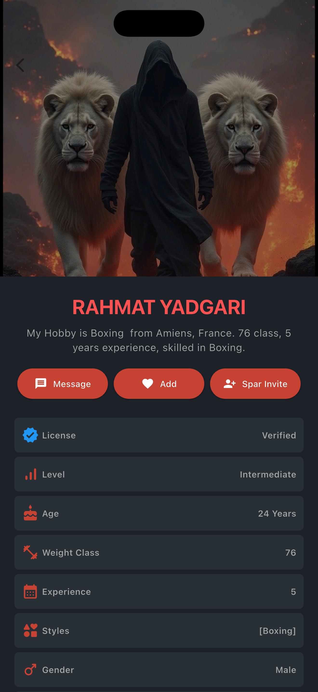
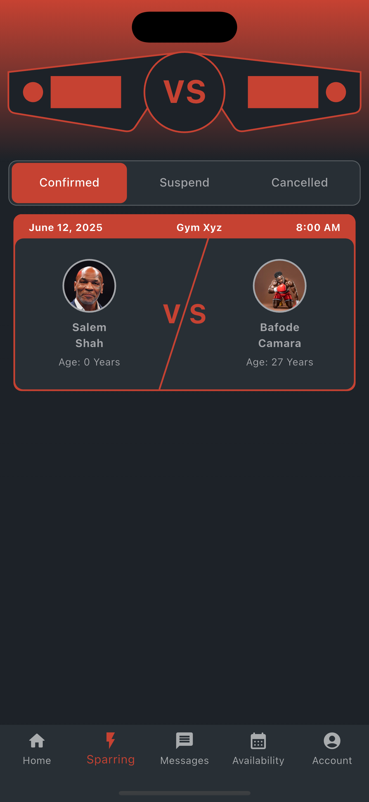
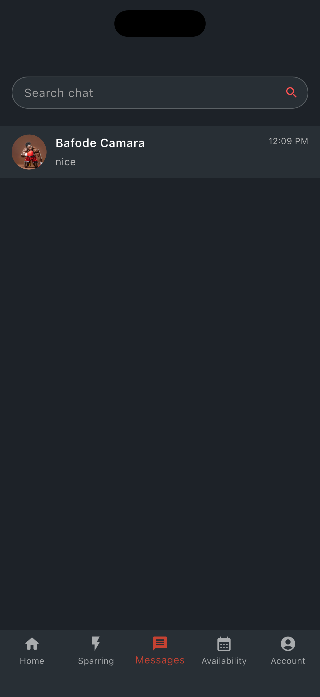
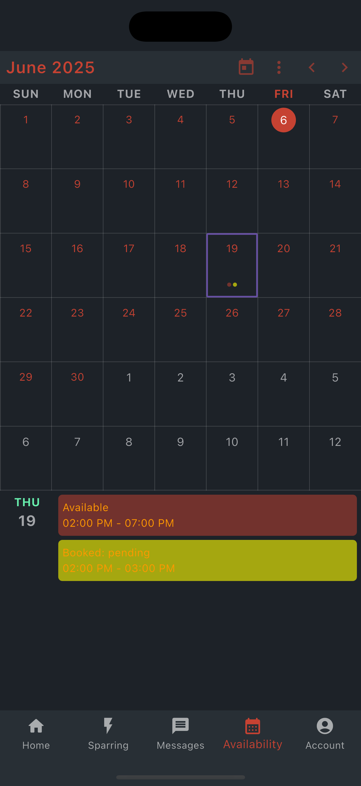
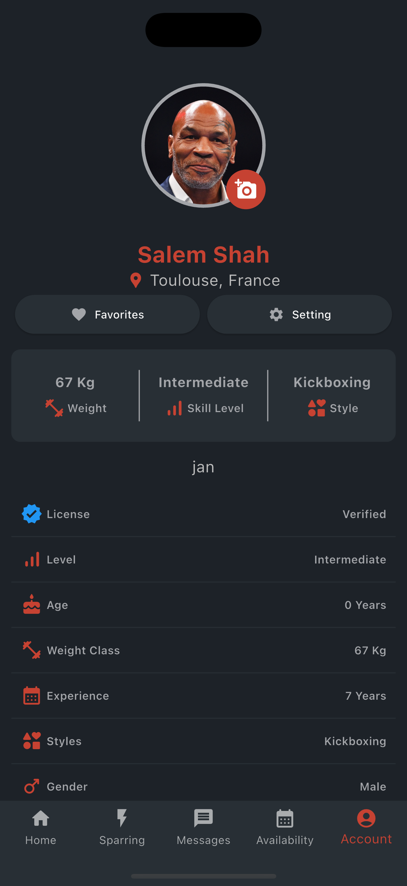
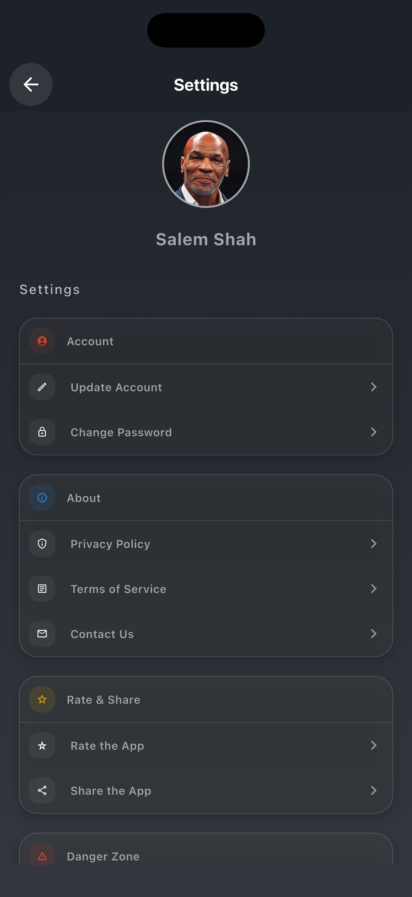

# App Screen Guide

This document explains how to use each of the major screens in the sparring-finder app. Each section corresponds to one screen and provides step-by-step instructions for common actions.

---

## 1. Home List Screen
### How to Use

1. **Browse Athletes in List View**
    - Scroll vertically to see all athlete cards (filtered or unfiltered).
    - Each card shows:
        - Profile photo (or placeholder)
        - Name (e.g. Rahmat Yadgari)
        - Quick stats: Weight, City, Level, Gender
        - Heart icon on the right to favorite/unfavorite.

2. **Search by Name/City/Level**
    - Tap the field labeled “Search by name, city, level…”
    - Enter text (e.g. “Paris” or “Intermediate”). The list filters as you type.

3. **Open Filters**
    - Tap the **funnel** icon on the left of the search bar.
    - This opens the Home Filter Screen (see Section 5).

4. **Favorite an Athlete**
    - Tap the **heart icon** on the right side of any athlete card.
    - The outline heart fills in to show they’ve been added to Favorites.

5. **Open an Athlete’s Profile**
    - Tap anywhere on an athlete’s card (not just the heart).
    - This opens that athlete’s detailed Profile screen (Section 1).

6. **Switch to Map View**
    - Tap the **map icon** (next to the list icon).
    - The view toggles to the Home Map Screen (Section 7).

7. **Clear Filters**
    - If filters are active, a **Clear Filters** link appears just below the search bar.
    - Tap it to remove all filters and show every athlete again.

8. **Navigate to Other Sections**
    - Use the bottom bar:
        - **Home (current)** → Sparring → Messages → Availability → Account

---

## 2. Home Map Screen

### How to Use

1. **View Athletes Geographically**
    - The map displays pins (profile thumbnails with red borders) at each athlete’s approximate city location.

2. **Pan & Zoom**
    - Use standard pinch/zoom gestures to zoom in or out.
    - Drag to pan around the map. The example view shows France and neighboring countries.

3. **Tap a Map Pin**
    - Tap an athlete’s circular thumbnail.
    - A pop-up tooltip may appear (e.g. athlete’s name).
    - Tap the pop-up or thumbnail again to open their Athlete Profile (Section 1).

4. **Search by Keyword**
    - Tap the search bar labeled “Search by name, city, level…”
    - Enter text (e.g. “Lyon” or “Beginner”). The map may zoom to matching pins.

5. **Apply or Clear Filters**
    - Tap the funnel icon next to the search bar to open filters (Section 5).
    - After applying, only matching pins remain visible.
    - If filters are active, tap **Clear Filters** to show all pins again.

6. **Switch to List View**
    - Tap the **list icon** (next to the map icon) to return to the Home List Screen (Section 6).

7. **Navigate to Other Sections**
    - Use the bottom bar:
        - Home (highlighted) → Sparring → Messages → Availability → Account

---

## 3. Home Filter Screen
### How to Use

1. **Open Filters from Home**
    - On the Home screen (List or Map), tap the **filter funnel** icon next to the search bar.
    - This brings up the filter modal.

2. **Select Skill Level**
    - Tap **Select level** to choose from Beginner, Intermediate, Advanced, or Professional.

3. **Select Location**
    - Tap **Select country** and choose a country.
    - Once a country is chosen, tap **Select city** to pick a city within that country.

4. **Choose Gender**
    - Tap **Select gender** and pick Male, Female, or Any.

5. **Adjust Weight Range**
    - Drag the left handle to set minimum opponent weight (e.g. 60 kg).
    - Drag the right handle to set maximum weight (e.g. 80 kg).
    - The range updates in real time (displayed as “Weight Range: 40 kg – 150 kg”).

6. **Apply Filters**
    - Tap the red **Apply Filters** button at the bottom.
    - The Home List or Map will refresh to show only athletes who match all selected criteria.

7. **Clear Filters**
    - After applying, if you want to remove all filters, tap the **Clear Filters** link on the Home screen.

---

## 4. Athlete Profile Screen

### How to Use

1. **View Athlete Information**
    - The top area shows the athlete’s cover image, name, and a short bio (location, weight class, years of experience, and style).

2. **Send a Message**
    - Tap the **Message** button (speech-bubble icon).
    - This opens a one-on-one chat window with that athlete.

3. **Add to Favorites**
    - Tap the **Add** button (heart icon).
    - The heart will fill in to indicate the athlete was added to your Favorites list.

4. **Send a Spar Invite**
    - Tap the **Spar Invite** button (person-plus icon).
    - Fill in date, time, and optional notes in the prompt that appears.
    - Confirm to send the invitation. You can track its status under the **Sparring** tab.

5. **Scroll Down to See Detailed Stats**
    - **License**: “Verified” if their credentials are confirmed.
    - **Level**: Athlete’s skill level (e.g. Intermediate).
    - **Age**: Their age in years.
    - **Weight Class**: Their fighting weight.
    - **Experience**: Number of years training.
    - **Styles**: List of fighting styles (e.g. Boxing).
    - **Gender**: Athlete’s gender.

---

## 5. Sparring Screen
### How to Use

1. **View Confirmed Sessions**
    - By default, the **Confirmed** tab is highlighted in red.
    - Scroll down to see cards for each upcoming confirmed spar:
        - Each card shows date (e.g. June 12, 2025), location (e.g. Gym Xyz), and time (e.g. 8:00 AM).
        - Below that, you see the “VS” layout with your profile on the left and your opponent on the right (each with name and age).

2. **Switch to Suspended or Cancelled**
    - Tap the **Suspend** tab to see any sessions on hold (e.g. postponed).
    - Tap the **Cancelled** tab to view any completely cancelled spar sessions.

3. **Interact with a Confirmed Card**
    - Tap a confirmed spar card to view more details (gym address, opponent profile, or chat link).
    - Some apps let you long-press to cancel or reschedule. If supported, follow the prompt on screen.

4. **Manage Suspended Items**
    - In **Suspend**, tap a session to propose a new date/time or cancel it entirely.

5. **Review Cancelled Items**
    - In **Cancelled**, you can review the history of any spar that was called off. (There is typically no further action here.)

6. **Navigate via Bottom Bar**
    - Home → **Sparring** (highlighted) → Messages → Availability → Account

---

## 6. Chat List Screen
### How to Use

1. **Search Chats**
    - Tap the **Search chat** field at the top.
    - Type a name or keyword to filter your chat list in real time.

2. **Open a Conversation**
    - Scroll through the list of existing chats.
    - Tap a row (e.g. “Bafode Camara”) to open that one-on-one chat.

3. **Read Last Message Preview**
    - Each row shows a profile photo, contact name, last message snippet, and timestamp.
    - This helps you know which conversation to open.

4. **Return to Home**
    - Use the bottom navigation bar:
        - Home → Sparring → **Messages (current)** → Availability → Account.

---

## 7. Chat Screen

### How to Use

1. **Send a Text Message**
    - Tap the “Type a message…” field at the bottom to open the keyboard.
    - Enter your text, then tap the red **Send** (paper-plane icon).
    - Your outgoing messages appear in red bubbles on the right.

2. **Read Incoming Messages**
    - Incoming texts appear as dark gray bubbles on the left, with timestamps below each.
    - Scroll up or down to review older messages.

3. **Scroll Through History**
    - Swipe up to load earlier parts of the conversation.

4. **Return to Chat List**
    - Tap the back arrow (top-left) to go back to the Chat List screen.

---

## 8. Availability

### How to Use

1. **Browse the Monthly Calendar**
    - Red dots under dates indicate days where you have marked yourself “Available.”
    - Yellow dots indicate days with at least one “Booked” (pending or confirmed) spar session.
    - The current date is highlighted with a filled circle.

2. **Select a Date**
    - Tap any date cell (for example, “19” in June).
    - The bottom panel will display all entries for that day.

3. **View “Available” Slots**
    - Under the selected date, look for a card labeled **Available**.
    - It shows the time range you marked as free (e.g. 02:00 PM–07:00 PM).

4. **View “Booked” Sessions**
    - Below the Available card, you’ll see any **Booked: pending** or **Booked: confirmed** entries.
    - Tapping a Booked card may allow you to cancel or reschedule (depending on app behavior).

5. **Add New Availability**
    - Tap the three-dot menu (⋮) or the calendar-icon shortcut at the top.
    - Choose “Add Availability,” then enter date, start time, end time (and optional location/notes).
    - Save to have a new red “Available” card appear on that date.

6. **Switch Between Months**
    - Tap the left (<) or right (>) arrow next to “June 2025.”
    - You can also tap the calendar icon to jump directly to “Today” or select another month.

7. **Navigate to Other Sections**
    - Use the bottom bar:
        - Home (house icon)
        - Sparring (lightning icon)
        - Messages (chat icon)
        - **Availability** (calendar icon, highlighted here)
        - Account (person icon)

---

## 9. Account Profile Screen
### How to Use

1. **Change Your Profile Photo**
    - Tap the red camera icon that overlaps your circular profile picture.
    - Choose an existing photo or take a new one. Save, and your profile photo updates everywhere in the app.

2. **View Your Basic Info**
    - Your name (“Salem Shah”) and location (“Toulouse, France”) appear just below the photo.
    - Below that, you see a quick-stats card with:
        - **Weight** (e.g. 67 Kg)
        - **Skill Level** (e.g. Intermediate)
        - **Style** (e.g. Kickboxing)

3. **Favorites**
    - Tap the **Favorites** button (heart icon) to view the list of athletes you have “hearted.”
    - This opens a filtered Home List showing only your favorited spar partners.

4. **Open Settings**
    - Tap the **Setting** button (gear icon) to jump to the Settings screen (Section 10).

5. **Review Detailed Stats**
    - Scroll down to see your full stats panel:
        - **License** (shows “Verified” if applicable)
        - **Level** (Intermediate/Advanced/etc.)
        - **Age** (in years)
        - **Weight Class** (e.g. 67 Kg)
        - **Experience** (e.g. 7 Years)
        - **Styles** (e.g. Kickboxing)
        - **Gender** (e.g. Male)
    - If any information is incorrect (e.g. Age reads “0 Years”), go to **Settings → Update Account** to fix it.

6. **Bottom Navigation**
    - Home → Sparring → Messages → Availability → **Account** (highlighted)

---

## 10. Settings Screen
### How to Use

1. **Navigate Back**
    - Tap the back arrow (top-left) to return to your Account Profile.

2. **Update Account Details**
    - Tap **Update Account** (pencil icon).
    - Edit your personal information:
        - Full name
        - Location (country & city)
        - Date of birth (so “Age” updates correctly)
        - Weight or weight class
        - Fighting experience (years)
        - Style(s) (Boxing, Kickboxing, etc.)
        - Skill level (Beginner, Intermediate, Advanced, Professional)
    - Tap **Save** to store changes.

3. **Change Your Password**
    - Tap **Change Password** (lock icon).
    - Enter your current password, then type a new password twice.
    - Tap **Submit** (or **Update**) to confirm.
    - If the current password is correct, you’ll see a success message. Otherwise, you’ll get an error prompt.

4. **About Section**
    - **Privacy Policy**: Tap to view the full privacy document (in-app or a webview).
    - **Terms of Service**: Tap to open the Terms-of-Service text.
    - **Contact Us**: Tap to open an email composer or in-app support form.

5. **Rate & Share**
    - **Rate the App**: Tap to open the App Store or Google Play page so you can leave a rating/review.
    - **Share the App**: Tap to open your device’s share sheet (SMS, email, social media) with a link to download the app.

6. **Danger Zone**
    - (Usually appears further down.) Options such as **Log Out** or **Delete Account** may be listed here.
    - **Log Out**: Tap to sign out. You will be taken to the login/registration screen.
    - **Delete Account**: Tap to permanently remove your account. A confirmation prompt will appear. Proceed only if you want to erase all data (chats, sparrings, etc.).

7. **Bottom Navigation**
    - Home → Sparring → Messages → Availability → **Account (current)**

---

### Quick Navigation Summary

- **Home Tab**: Browse and search for sparring partners (List or Map).
- **Sparring Tab**: View your upcoming confirmed, suspended, or cancelled sessions.
- **Messages Tab**: See an overview of all chats and open one to talk.
- **Availability Tab**: Manage your open time slots and see any bookings.
- **Account Tab**: Edit your profile, view favorites, and configure settings.

---

End of guide.
